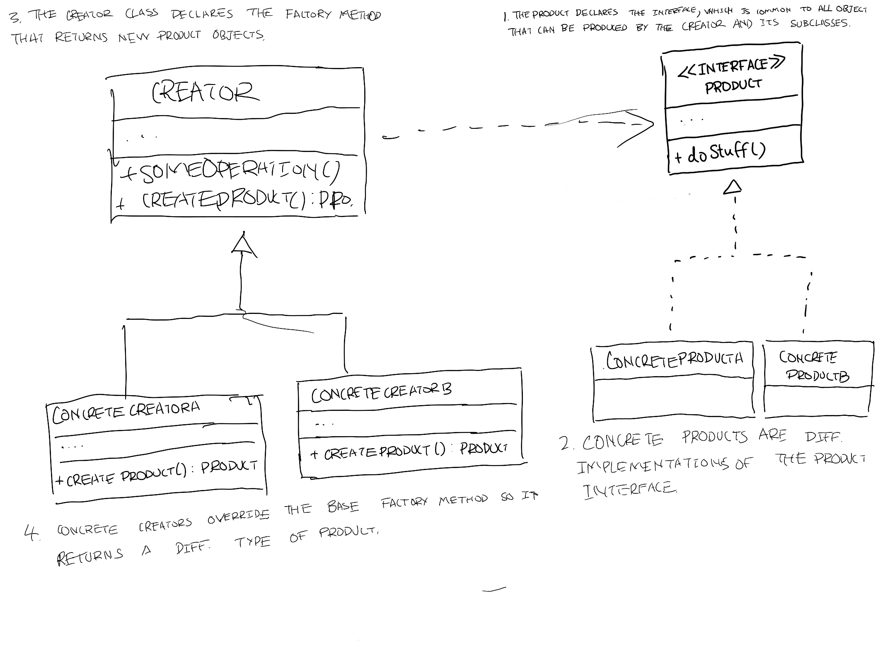

# Design patterns

<!-- markdown-toc start - Don't edit this section. Run M-x markdown-toc-refresh-toc -->
**Table of Contents**

- [Design patterns](#design-patterns)
    - [Factories](#factories)
        - [Factory methods](#factory-methods)
    - [Abstract factories](#abstract-factories)
        - [Applicability](#applicability)

<!-- markdown-toc end -->
## Factories
> An interface for creating objects in a super class but allows sub classes to alter the type of objects that will be created  
>

### Factory methods
Replace direct object construction call (using the new operator) with calls to a special factory method.

Objects returned by a factor methods are often referred as products

Sub classes can alter the class of objects being returned by the factory methods

 

### Applicability
* Use the factory method when you **don't know beforehand the exact types and dependencies of the objects your code should work with**
* Use the factory method when you want to **provide users of your library or framework with a way to extend its internal components**
* Use the factory method when you want to save system resources by reusing existing objects instead of rebuilding them each time.

### Pros 

* You avoid tight coupling between the creator and the concrete products.
* **Single responsibility principle**. You can move the **product creating mode** into one place in the program, making the code easier to support
* **Open-Closed principle**. You can introduce new types of products into the program without breaking existing client code

### Cons
* The code may become more complicated since you need to introduce a lot of new sub classes to implement the pattern

TODO add images

## Abstract factories

> Abstract factory is a creations design pattern that lets you product families of related objects without specifying their contrite classes.

* Explicitly declare interfaces for each distinct product of the family (e.g. chair, sofa or coffee table)

* Make all variants of products follow those interfaces
    * e.g. all chair variants can implement the chair interface; all coffee table variants can implement the CoffeeTable interface and so on.

* All variants of the same object must be moved to a single class hierarchy.

* Each concrete factory corresponds to a specific product variant.

 

### Applicability 
* Use the Abstract Factory when your code needs to work with various families of related products, but you don't want it to depend on the concrete classes of those products - they might be unknown beforehand or you simply want to allow for future extensible.

* Consider implementing the abstract factory when you have a class with a set of Factory Methods that blur its primary responsibility.
