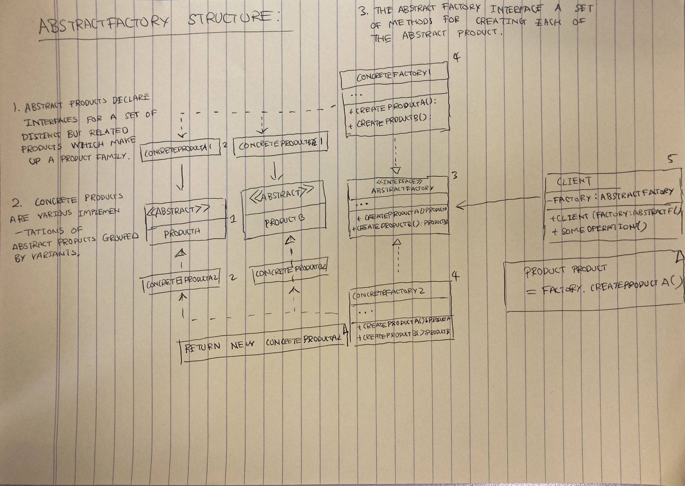

# Design patterns

<!-- markdown-toc start - Don't edit this section. Run M-x markdown-toc-refresh-toc -->
**Table of Contents**

- [Design patterns](#design-patterns)
    - [Factories](#factories)
        - [Factory methods](#factory-methods)
        - [Applicability](#applicability)
        - [Pros](#pros)
        - [Cons](#cons)
    - [Abstract factories](#abstract-factories)
        - [Applicability](#applicability-1)
        - [Pros](#pros-1)
        - [Cons](#cons-1)
    - [Singleton](#singleton)
        - [Solution](#solution)
        - [Applicability](#applicability-2)
        - [Pros](#pros-2)
        - [Cons](#cons-2)

<!-- markdown-toc end -->
## Factories
> An interface for creating objects in a super class but allows sub classes to alter the type of objects that will be created  
>

### Factory methods
Replace direct object construction call (using the new operator) with calls to a special factory method.

Objects returned by a factor methods are often referred as products

Sub classes can alter the class of objects being returned by the factory methods

 

### Applicability
* Use the factory method when you **don't know beforehand the exact types and dependencies of the objects your code should work with**
* Use the factory method when you want to **provide users of your library or framework with a way to extend its internal components**
* Use the factory method when you want to save system resources by reusing existing objects instead of rebuilding them each time.

### Pros 

* You avoid tight coupling between the creator and the concrete products.
* **Single responsibility principle**. You can move the **product creating mode** into one place in the program, making the code easier to support
* **Open-Closed principle**. You can introduce new types of products into the program without breaking existing client code

### Cons
* The code may become more complicated since you need to introduce a lot of new sub classes to implement the pattern

TODO add images

## Abstract factories

> Abstract factory is a creations design pattern that lets you product families of related objects without specifying their contrite classes.

* Explicitly declare interfaces for each distinct product of the family (e.g. chair, sofa or coffee table)

* Make all variants of products follow those interfaces
    * e.g. all chair variants can implement the chair interface; all coffee table variants can implement the CoffeeTable interface and so on.

* All variants of the same object must be moved to a single class hierarchy.

* Each concrete factory corresponds to a specific product variant.

 

### Applicability 
* Use the Abstract Factory when your code needs to work with various families of related products, but you don't want it to depend on the concrete classes of those products - they might be unknown beforehand or you simply want to allow for future extensible.

* Consider implementing the abstract factory when you have a class with a set of Factory Methods that blur its primary responsibility.

### Pros
* You can be sure that products you are getting from a factory are **compatible** with arch other
* You avoid tight coupling between concrete product and client code
* **Single responsibility principle**. You can extract the product **create code into one place** making the code easier to support.
* **Open/closed principle**. You can introduce **new variants of products** without breaking existing client code

### Cons
* The code may become more complicated then it should be, since a lot of new interfaces and classes are introduced along with the pattern

## Singleton
> Singleton is a creational design pattern that lets you **ensure that a class has only one instance** while providing a **global access** point to this instance

* Singleton pattern solves two problems:
    * Access to some shared resources - for example a **database or file**
        * Imagine that you created an object, but after a while decided to create a new one
        * Instead of receiving a fresh object, you'll get the one you already created.
        
    * Provide a global access point to that instance
    
    
* However it violates the Single Responsibility Principle
    * TODO why?

* The singleton pattern has become so popular that people may call something a singleton even though hit solves just one of the listed problems.

### Solution
* All implementations of the Singleton pattern have these two steps in common:
    * Make the default constructor private, to prevent other objects from using the new operator with the singleton class
    * Create a static creation method that acts as a constructor. 
        * This method calls the private constrictor to create an object and saves it in a static field.
        * All following class to this method return the cached object.
        
    * Example: The government is an excellent example of the Singleton pattern:
        * A country can have only one official government
        * Regardless of the personal identities of the individuals who form governments, the title, "The government x", is a global access point that identifies the group of people in charge.
 
### Applicability
* Use the singleton pattern when a class in your program should have just a **single instance of available to all clients**, for example, a single database object shared by different parts of the program.
* Use the singleton pattern when you need stricter control over global variables.

### Pros
* You can  be sure that a class has **only a single instance**
* You gain a global access point to that instance
* The singleton object is initialised only when it's requested for the first time

### Cons
* Violates the **Single Responsibility Principle**
* The Singleton pattern **can mask bad design**, e.g. when the components of the program know too much about each other.
* The pattern requires special treatment in a multi threaded environment
* It maybe be difficult to unit test the client code of the Singleton because may test frameworks reply on inheritance when producing mock objects.
